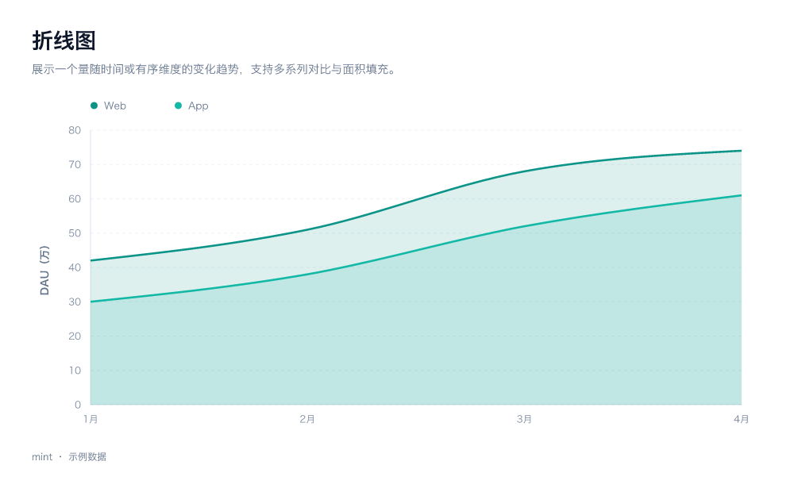
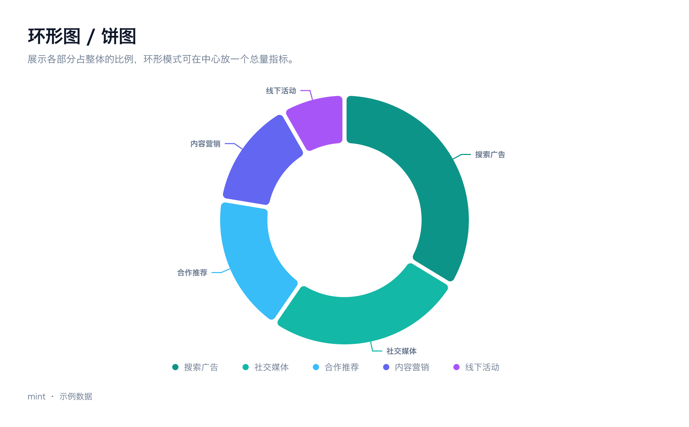
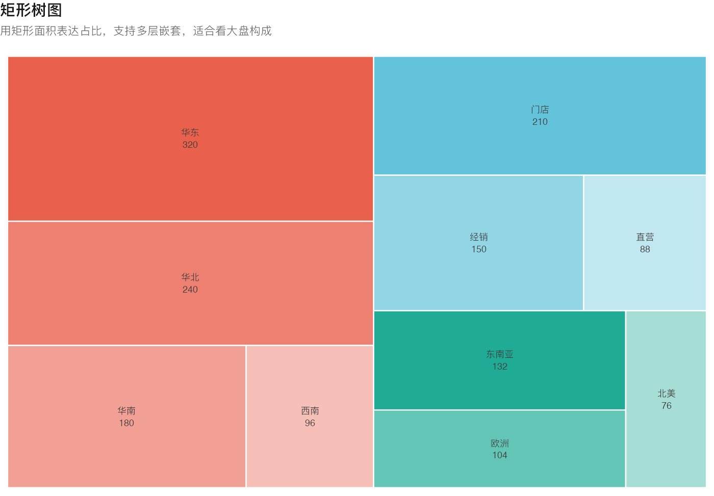
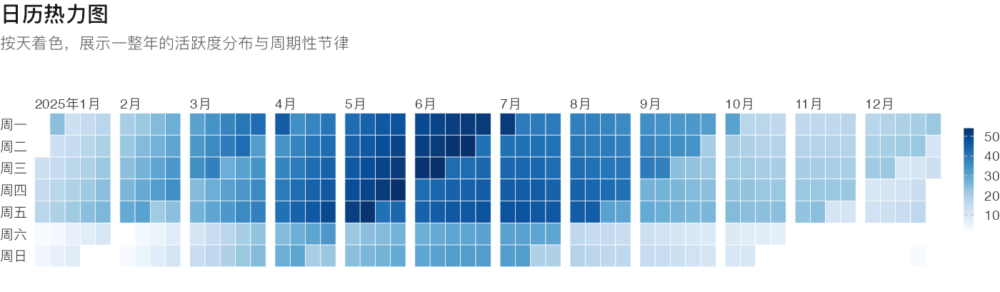
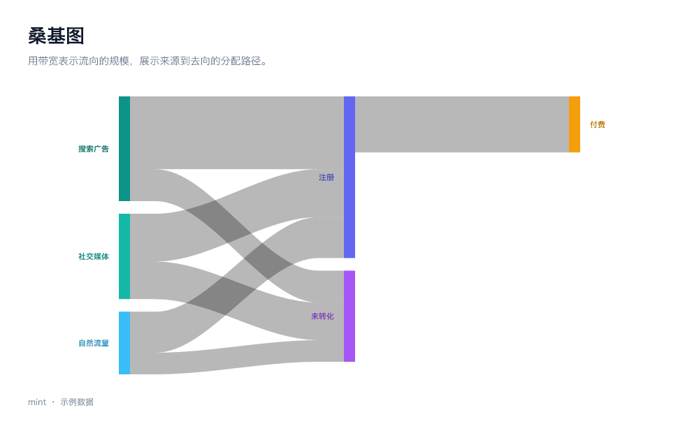

# mint

**把数据变成美观的图表。** 一条命令，把一份 JSON 渲染成可以直接嵌进报告的成品图。

```bash
mint render bar --data revenue.json --title "各区域季度营收" --subtitle "单位：百万元" -o revenue.png
```

mint 是给 AI 和工程师用的图表 CLI：内置 20 种经过端到端测试的图表、7 套调色板、明暗两套主题，
中文标签开箱可用。所有图表由 [nivo](https://github.com/plouc/nivo) 在服务端渲染成 SVG，
再由 [resvg](https://github.com/RazrFalcon/resvg) 光栅化为 PNG —— **不依赖浏览器**，单张图通常 100ms 内完成。

---

# 🤖 给 AI Agent：安装说明

> **如果你是一个 AI agent，读完这一节就够了。**
> 目标是把两样东西装到这台机器上：
> 1. `mint` 可执行文件
> 2. `mint` skill（软链到这台机器上 agent 读 skill 的目录，默认 `~/.agents/skills/mint`）
>
> 全程都是可直接复制的命令，没有需要交互式回答的提示。

## 最快路径

```bash
command -v bun >/dev/null || curl -fsSL https://bun.sh/install | bash
git clone https://github.com/HelloAnner/mint.git ~/.local/share/mint
cd ~/.local/share/mint && make install
```

然后验证（期望每一项都是 ✓）：

```bash
~/.local/bin/mint doctor
```

## 第 0 步：先判断是不是已经装过

```bash
command -v mint && mint --version && mint doctor
```

| 结果 | 下一步 |
|------|--------|
| 没有输出 / 命令不存在 | 没装，继续第 1 步 |
| 有版本号，但 `doctor` 里有 ✗ | 看最后面的「排错」 |
| `doctor` 全部 ✓ | **已经装好了**，跳到「装好之后怎么用」 |

## 第 1 步：安装 CLI

### 1.1 确认 bun 可用（用它编译）

```bash
command -v bun || curl -fsSL https://bun.sh/install | bash
export PATH="$HOME/.bun/bin:$PATH"
bun --version          # 需要 >= 1.1
```

### 1.2 克隆并安装

```bash
git clone https://github.com/HelloAnner/mint.git ~/.local/share/mint
cd ~/.local/share/mint
make install
```

`make install` 一次做完两件事：

| 动作 | 结果 |
|------|------|
| `bun build --compile` | 产出单文件二进制，装到 `~/.local/bin/mint` |
| 软链 skill | `~/.agents/skills/mint` → `~/.local/share/mint/skills/mint` |

换安装位置：`make install PREFIX=/usr/local`（二进制会装到 `$PREFIX/bin/mint`）。

### 1.3 确保 `mint` 在 PATH 里

```bash
echo 'export PATH="$HOME/.local/bin:$PATH"' >> ~/.zshrc
export PATH="$HOME/.local/bin:$PATH"
mint --version
```

### 没有 git 或没有 make 时的替代方案

```bash
# 没有 git：改用 tarball 下载
mkdir -p ~/.local/share && cd ~/.local/share
curl -fsSL https://github.com/HelloAnner/mint/archive/refs/heads/main.tar.gz | tar xz
mv mint-main mint

# 没有 make：手动执行 make install 的两步
cd ~/.local/share/mint
bun install
bun run scripts/build.ts                          # 编译，产出 dist/mint
install -m 755 dist/mint ~/.local/bin/mint        # 装 CLI
mkdir -p ~/.agents/skills
ln -sfn "$PWD/skills/mint" ~/.agents/skills/mint  # 装 skill
```

## 第 2 步：安装 skill

**`make install` 里已经包含了这一步。** 需要单独装、重装或换目录时：

```bash
mint install skill            # 装到 ~/.agents/skills/mint（默认位置）
mint install skill --force    # 覆盖已有安装
```

不同 agent 约定的 skill 目录不同，用 `MINT_SKILLS_DIR` 指定：

```bash
MINT_SKILLS_DIR=~/.claude/skills mint install skill
```

完全不跑 CLI 的等价做法（本质就是一条软链）：

```bash
mkdir -p ~/.agents/skills
ln -sfn "$HOME/.local/share/mint/skills/mint" ~/.agents/skills/mint
```

装好后 agent 读到的入口是 `~/.agents/skills/mint/SKILL.md`
（YAML frontmatter 里有 `name: mint` 和触发用的 description）。

> **兜底机制**：每次运行 `mint` 都会检查 skill 是否已安装，没有就自动补装。
> 所以即使漏了这一步，第一次跑 `mint render` 时也会自动补上。
> 想关掉：`MINT_NO_AUTO_SKILL=1`。

## 第 3 步：验证

逐条执行，全部通过才算装好：

```bash
# 1) 环境自检：运行时 / 字体 / 光栅化后端 / 图表 / skill 安装
mint doctor

# 2) skill 可读
head -3 ~/.agents/skills/mint/SKILL.md

# 3) 真出一张图
mint render bar -o /tmp/mint-check.png && file /tmp/mint-check.png
# 期望：PNG image data, 2560 x 1520

# 4) 验证用的临时文件记得删掉
rm -f /tmp/mint-check.png
```

## 装好之后怎么用

```bash
mint list                      # 20 种图表一览
mint info bar                  # 某张图的数据结构、选项、可运行示例
mint palettes                  # 7 套调色板
mint render bar --data data.json --title "标题" -o out.png
```

完整用法（怎么选图、数据写成什么形状、临时文件清理纪律）都在 skill 里：
`~/.agents/skills/mint/SKILL.md` 及同目录的 `references/`。

## 卸载

```bash
mint uninstall skill          # 移除 ~/.agents/skills/mint 软链
rm -f ~/.local/bin/mint       # 移除 CLI
rm -rf ~/.local/share/mint    # 移除源码目录
rm -rf ~/.mint                # 移除二进制模式释放出来的 skill 内容
```

## 排错

| 现象 | 原因与处理 |
|------|-----------|
| `mint: command not found` | `~/.local/bin` 不在 PATH，见 1.3 |
| `bun: command not found` | 没装 bun，见 1.1 |
| `make: command not found` | macOS 跑 `xcode-select --install`；或按「没有 make 的替代方案」手动装 |
| `doctor` 字体一项是 ✗ | 系统缺中文字体；装一个（如 Noto Sans CJK），或设 `MINT_FONT=/path/to/font.ttc` |
| 图里中文显示成方框 | 同上，字体没匹配上 |
| `doctor` 光栅化后端是 ✗ | 二进制损坏，重新 `make build` |
| 编译偏慢 / 产物约 64MB | 正常：resvg 的 wasm 与 skill 内容都内嵌在里面 |
| `SKILL_EXISTS` | 目标路径已存在且不是 mint 管理的安装，确认可覆盖后加 `--force` |
| `CANVAS_TOO_SMALL` | 画布减掉标题留白后太小，调大 `--width` / `--height` |
| `INVALID_DATA` | 数据结构不符合该图表要求，`mint info <chart>` 里有正确示例 |

## 环境变量

| 变量 | 作用 |
|------|------|
| `MINT_FONT` | 指定字体文件路径（.ttf / .otf / .ttc） |
| `MINT_SKILLS_DIR` | 覆盖 skills 根目录，默认 `~/.agents/skills` |
| `MINT_NO_AUTO_SKILL=1` | 关闭运行时的 skill 自动安装 |
| `MINT_DEBUG=1` | 打印 React 渲染告警与错误堆栈 |
| `MINT_QUIET=1` | 静默模式 |

---

# 项目说明

## 预览

下面都是 `mint render <chart>` 用内置示例数据直接产出的原图（可点开看大图）：

| | |
|---|---|
| [](docs/images/bar.png) | [](docs/images/line.png) |
| [](docs/images/pie.png) | [](docs/images/treemap.png) |
| [](docs/images/calendar.png) | [](docs/images/sankey.png) |

想自己生成全部 20 张：`make examples`，产物在 `out/examples/`。

## 为什么是 mint

| | |
|---|---|
| **不用写代码** | 传 JSON 就出图，不需要起 React 工程、不需要配构建 |
| **不依赖浏览器** | 渲染是纯 JS + WASM，没有 Playwright/Puppeteer 那几百 MB 的负担 |
| **产物是成品** | 自动排版标题、副标题、脚注与留白，不是裸图 |
| **AI 友好** | 内置 skill，AI 助手装上就知道有哪些图、怎么传数据 |
| **单文件分发** | `bun build --compile` 打成一个二进制，skill 内容一起内嵌 |

## 图表

| 分类 | 图表 |
|------|------|
| 比较 | `bar` 柱状图 · `radar` 雷达图 · `radial-bar` 径向条形图 · `bullet` 子弹图 |
| 趋势 | `line` 折线图 · `stream` 堆叠面积图 · `bump` 排名变化图 |
| 构成 | `pie` 环形/饼图 · `waffle` 华夫图 · `marimekko` 马赛克图 |
| 关系 | `scatter` 散点/气泡图 · `parallel-coordinates` 平行坐标图 |
| 分布 | `heatmap` 热力图 · `calendar` 日历热力图 |
| 层级 | `treemap` 矩形树图 · `sunburst` 旭日图 · `icicle` 冰柱图 · `circle-packing` 圆形打包图 |
| 流向 | `funnel` 漏斗图 · `sankey` 桑基图 |

每张图还支持多种形态（`bar` 支持分组/堆叠/横向，`pie` 支持实心/环形，`bump` 支持折线/面积）。
完整清单与数据结构见 [skills/mint/references/charts.md](skills/mint/references/charts.md)，
或直接跑 `mint list` / `mint info <chart>`。

## 命令

```
mint render <chart> [options]     渲染一张图
mint batch <spec.json>            按 spec 批量渲染
mint list                         列出全部图表
mint info <chart>                 数据结构、选项与示例
mint palettes                     列出调色板
mint doctor                       环境自检
mint install skill                安装 skill 软链
mint uninstall skill              移除 skill 软链
mint skill [status|path|list|show]  查看 skill 状态
```

渲染参数：

| 参数 | 说明 | 默认 |
|------|------|------|
| `-d, --data <file\|->` | 数据 JSON，`-` 表示 stdin | 该图的内置示例数据 |
| `-o, --out <file>` | 输出路径，`-` 写到 stdout | `./<chart>.png` |
| `-t, --title` / `-s, --subtitle` / `--footnote` | 标题与脚注 | 无 |
| `-W, --width` / `-H, --height` | 逻辑尺寸 | 1280 × 760 |
| `--scale` | 像素倍数 | 2 |
| `--theme` | `light` / `dark` | light |
| `--palette` | 调色板 id | mint |
| `--format` | `png` / `svg` / `both` | png |
| `--set k=v` | 图表选项，可重复 | — |
| `--options '<json>'` | 选项 JSON | — |
| `--font <path>` | 指定字体（.ttf/.otf/.ttc） | 自动探测 |
| `--json` | 输出机器可读结果 | — |

退出码：`0` 成功，`1` 运行失败，`2` 用法错误。

## 数据格式

**大多数情况一个数组就够了**，mint 会自动判断哪列是分类、哪列是数值：

```json
[
  { "quarter": "Q1", "华东": 128, "华北": 96 },
  { "quarter": "Q2", "华东": 152, "华北": 108 }
]
```

也直接吃这些常见形状：

```jsonc
{ "搜索": 348, "社交": 266 }                        // 占比类
[{ "id": "Web", "data": [{ "x": "1月", "y": 42 }] }]  // 折线类
[{ "x": "1月", "y": 42, "channel": "Web" }]           // 扁平记录，自动分组
{ "name": "总计", "children": [{ "name": "华东", "value": 320 }] }   // 层级类
[{ "path": "线上/华东/上海", "value": 120 }]           // 用 / 自动建树
{ "links": [{ "source": "搜索", "target": "注册", "value": 320 }] }  // 流向类
```

数据也可以从 stdin 传，这样连数据文件都不用落盘：

```bash
printf '%s' '[{"quarter":"Q1","华东":128}]' | mint render bar --data - -o out.png
```

## 批量出图

```jsonc
{
  "defaults": { "palette": "indigo", "width": 1280, "height": 760, "scale": 2 },
  "charts": [
    { "chart": "bar",  "dataFile": "revenue.json", "out": "out/01-revenue.png",
      "title": "各区域季度营收" },
    { "chart": "line", "dataFile": "dau.json",     "out": "out/02-dau.png",
      "title": "日活趋势", "options": { "area": true } },
    { "chart": "pie",  "data": { "搜索": 348, "社交": 266 }, "out": "out/03-channel.png" }
  ]
}
```

```bash
mint batch report.json
```

`dataFile` 相对 spec 文件所在目录解析；某一项失败不会中断其余渲染，最后统一汇总。

## 主题与调色板

`--theme` 只管明暗，`--palette` 管色彩倾向，两者正交组合。

| id | 名称 | 适用 |
|----|------|------|
| `mint` | 薄荷 | 默认，增长与产品类数据 |
| `indigo` | 靛蓝 | 商务报告与汇报 |
| `sunset` | 日落 | 营销与创意主题 |
| `ocean` | 海洋 | 流量、渠道与地理数据 |
| `forest` | 森林 | 生态、健康与可持续 |
| `candy` | 糖果 | 面向大众的轻量内容 |
| `mono` | 单色 | 黑白印刷与极简报告 |

热力图、日历图这类顺序色阶会自动从调色板主色派生出由浅到深的阶梯，保证同一主题下视觉一致。

## 架构

```
JSON 数据 ──▶ 数据归一化 ──▶ nivo 组件 ──▶ React SSR ──▶ SVG ──▶ 卡片排版 ──▶ resvg-wasm ──▶ PNG
                helpers.ts      charts/*.tsx   render.ts           frame.ts     raster.ts
```

关键设计取舍：

- **React 服务端渲染而不是无头浏览器**：nivo 的几何计算发生在 render 期间，
  因此 `renderToStaticMarkup` 就能拿到完整 SVG，不需要真实 DOM。
  所有图表统一传 `animate={false}`，避免 react-spring 在服务端留下初始态。
- **resvg-wasm 而不是 sharp/canvas**：WASM 没有原生依赖，既方便本地安装，
  也能被 `bun build --compile` 直接打进单文件二进制。
- **卡片排版在 SVG 层做**：nivo 只负责绘图区，标题、副标题、脚注、留白由 `frame.ts`
  统一处理，因此 20 张图的排版规范完全一致。
- **字体从系统探测**：resvg 不自带字体，mint 会按平台候选列表（PingFang / 冬青黑 /
  思源黑体 / 文泉驿…）挑一个支持中文的，找不到时回落到 fontconfig。

### 目录

```
src/
  cli.ts                 入口与命令分发
  commands/              render / batch / list / skill / doctor
  cli/                   参数解析、选项解析
  core/
    render.ts            渲染管线
    frame.ts             标题卡片排版
    raster.ts            resvg-wasm 光栅化
    fonts.ts             字体探测
    palettes.ts          调色板与主题
    registry.ts          图表注册表
    skills.ts            skill 安装与自检
    spec.ts / output.ts  输入校验与输出路径
  charts/                20 个图表定义
  generated/             由 scripts/embed.ts 生成（内嵌文件清单）
skills/mint/             skill 内容（SKILL.md + references）
scripts/                 embed（生成文档与内嵌清单）、build（编译）、examples
tests/                   54 项测试，含每张图的端到端渲染
```

## Skill 机制

`~/.agents/skills/mint` 是各类 AI 助手约定的 skill 目录，mint 通过软链接入：

- **源码模式**：软链指向仓库的 `skills/mint`，改 `SKILL.md` 立即生效。
- **二进制模式**：编译时 skill 内容已内嵌进二进制，运行时释放到
  `~/.mint/skills/mint` 再软链过去，因此单独分发二进制也能用。

```bash
mint skill status     # 当前状态、来源模式、内嵌文件数
mint skill path       # 实际生效的 skill 目录
mint skill show       # 打印 SKILL.md 内容
```

skill 里还写死了一条工作纪律：**生成过程中的临时文件（数据 JSON、batch spec、预览图、
调试用 SVG）必须在交付前全部删除，只保留最终的图片文件**。mint 自身只写 `-o` 指定的那一个
路径，不产生任何中间文件，所以只要输入侧不发散，收工时目录就是干净的。

## 开发

```bash
make dev           # 用源码跑 CLI
make test          # 54 项测试（含每张图的端到端渲染）
make typecheck     # tsc --noEmit
make examples      # 把每张图的示例渲染到 out/examples
make build         # 编译单文件二进制
make check         # typecheck + test + build
```

新增一张图表只需要：

1. 在 `src/charts/` 加一个文件，导出一个 `ChartDefinition`（含 `example`）；
2. 在 `src/charts/index.ts` 注册；
3. `make test` —— 端到端测试会自动覆盖它，`charts.md` 也会在构建时自动重新生成。

## License

MIT
