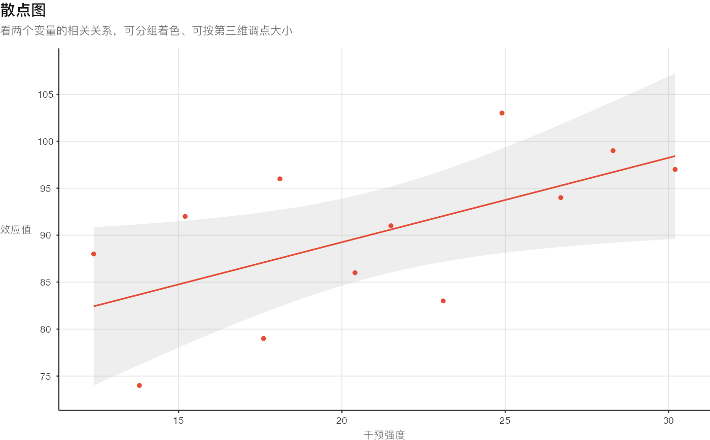
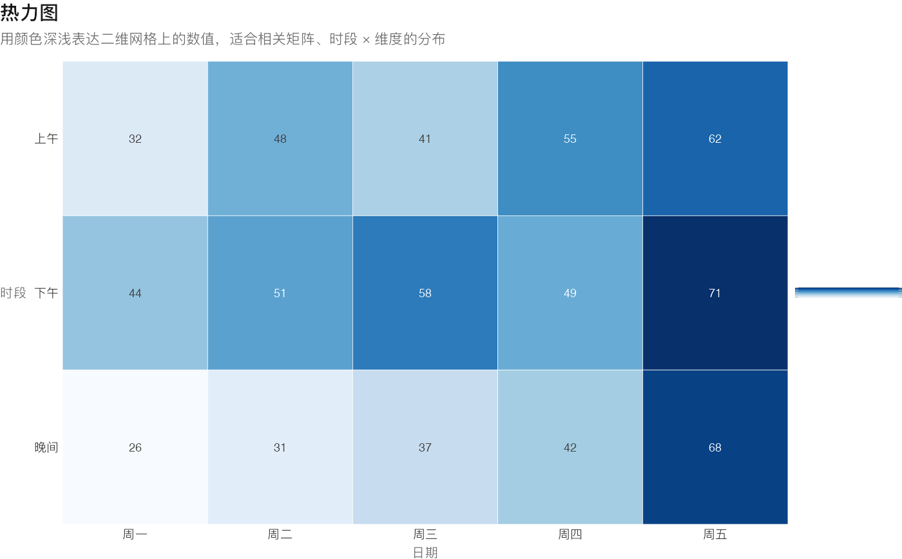
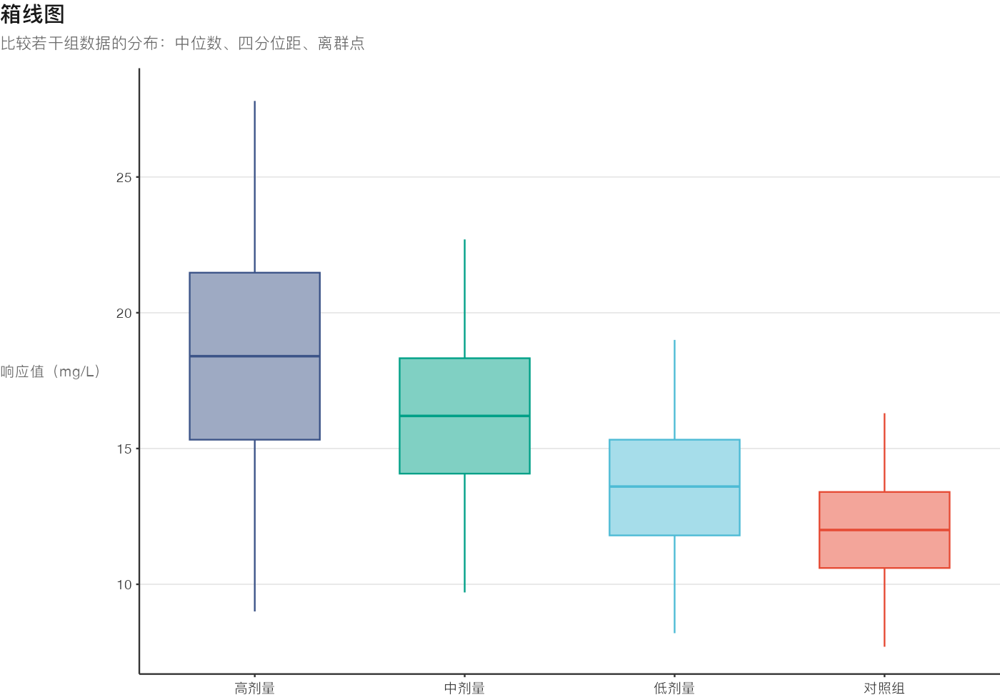
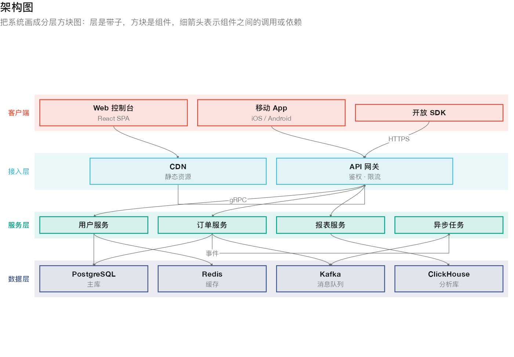
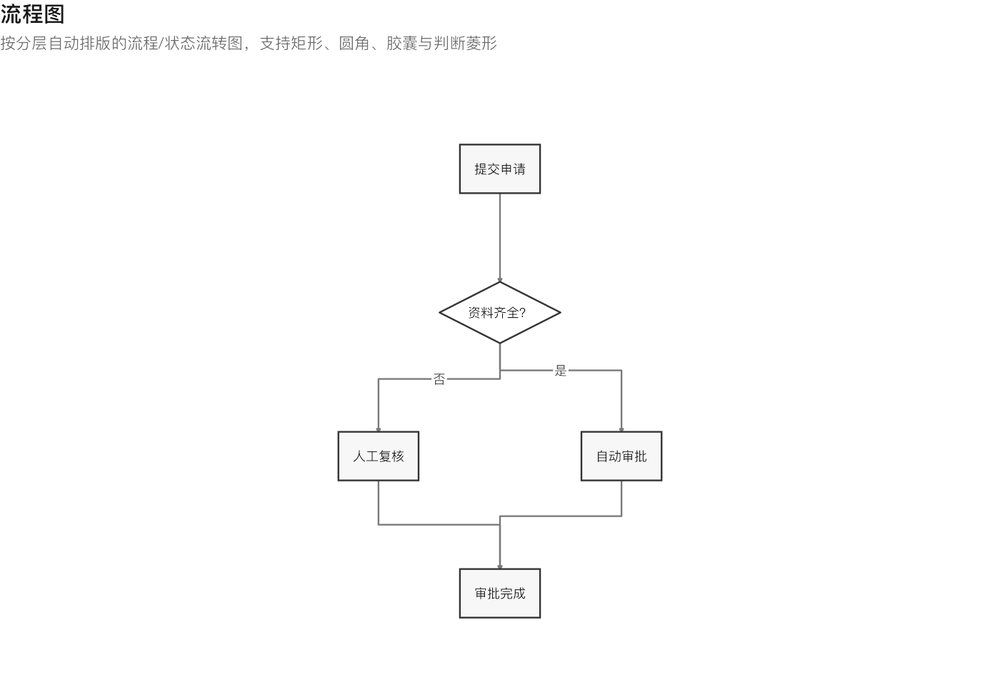

# mint

**把数据变成期刊级图表。** 一条命令，把一份 JSON 渲染成可以直接放进论文、报告、幻灯片的成品图。

```bash
mint render bar --data revenue.json --title "各区域季度营收" --subtitle "单位：百万元" -o revenue.png
```

mint 是给 AI agent 和工程师用的图表 CLI：内置 **27 种图表**、**10 套期刊调色板**、
一套克制专业的排版风格（`professional`），中文标签开箱可用。
渲染走 **R + ggplot2**，默认输出 7 × 4.35 英寸、300 dpi 的 PNG，
也可以直接产出**可编辑的矢量 SVG**（投稿首选）。不需要浏览器，不需要 Node。

- **期刊级观感**：细轴线、浅网格、小字号、高信息密度；不用渐变、不用圆角、不用阴影
- **尺寸即物理尺寸**：画布用英寸、分辨率用 dpi，7in × 300dpi 就是双栏满宽的 2100px
- **矢量可编辑**：`--format both` 一次拿到 PNG + SVG，SVG 里的文字仍然可选可改
- **配色有出处**：Nature / Science / NEJM / Lancet / JAMA / Okabe-Ito，色盲安全与黑白印刷都有对应方案
- **AI 友好**：内置 skill，AI 助手装上就知道有哪些图、数据怎么写

---

## 预览

下面都是 `mint render <chart>` 用内置示例数据直接产出的原图：

| | |
|---|---|
| [](docs/images/bar.png) | [](docs/images/line.png) |
| [](docs/images/scatter.png) | [](docs/images/heatmap.png) |
| [](docs/images/pie.png) | [](docs/images/treemap.png) |
| [](docs/images/boxplot.png) | [](docs/images/sankey.png) |
| [](docs/images/calendar.png) | [](docs/images/architecture.png) |
| [](docs/images/flowchart.png) | [](docs/images/sequence.png) |

想自己生成全部 27 张：`make examples`，产物在 `out/examples/`。

## 安装

### 一键脚本

```bash
curl -fsSL https://raw.githubusercontent.com/HelloAnner/mint/main/install.sh | bash
```

脚本会：检查 R → 取源码到 `~/.local/share/mint` → 把 R 依赖装到 `~/.local/share/mint/rlib`
→ 链接 `~/.local/bin/mint` → 链接 skill 到 `~/.agents/skills/mint` → 跑一次 `mint doctor`。

首次安装会从 CRAN 编译几十个 R 包（含 ggplot2 及其生态），需要几分钟；之后的安装会跳过。

### 从源码

```bash
git clone https://github.com/HelloAnner/mint.git ~/.local/share/mint
cd ~/.local/share/mint
make install          # = 装依赖 + 装 CLI + 装 skill
mint doctor           # 期望每一项都是 ✓
```

换安装位置：`make install PREFIX=/usr/local`；只装依赖：`make deps`。

### 前置条件

- **R ≥ 4.2**：macOS `brew install r`，其它平台见 <https://cran.r-project.org/bin/>
- **中文字体**：macOS 自带 PingFang，Linux 建议装 `fonts-noto-cjk`（否则中文会显示成方框）

## 快速开始

```bash
mint list                                   # 27 种图表一览
mint info bar                               # 数据结构、选项与示例
mint render bar -o bar.png                  # 不传 --data 就用内置示例数据
mint palettes                               # 调色板
mint styles                                 # 风格
mint doctor                                 # 环境自检
```

渲染参数（完整清单见 [skills/mint/references/spec.md](skills/mint/references/spec.md)）：

| 参数 | 说明 | 默认 |
|------|------|------|
| `-d, --data <file\|->` | 数据 JSON，`-` 表示 stdin | 该图内置示例数据 |
| `-o, --out <file>` | 输出路径，`-` 把 SVG 写到 stdout | `./<chart>.png` |
| `-t, --title` / `-S, --subtitle` / `--footnote` | 标题、副标题、脚注 | 无 |
| `-W, --width` / `-H, --height` | 画布尺寸，**英寸** | 7 × 4.35（按内容自动撑高） |
| `--dpi` | 分辨率 | 300 |
| `-f, --format` | `png` / `svg` / `both` | `png` |
| `-p, --palette` | 调色板 id | `npg` |
| `--style` | 风格 id | `professional` |
| `--set k=v` | 图表选项，可重复 | — |
| `--json` | 输出机器可读结果 | — |

## 图表

| 分类 | 图表 |
|------|------|
| 比较 | `bar` 柱状图 · `radar` 雷达图 · `radial-bar` 径向条形图 · `bullet` 子弹图 · `lollipop` 棒棒糖图 |
| 趋势 | `line` 折线图 · `stream` 河流图 · `bump` 排名变化图 |
| 构成 | `pie` 环形图 · `waffle` 华夫图 · `marimekko` 马赛克图 |
| 关系 | `scatter` 散点/气泡图 · `parallel-coordinates` 平行坐标图 · `architecture` 分层架构图 |
| 分布 | `heatmap` 热力图 · `calendar` 日历热力图 · `histogram` 直方图 · `boxplot` 箱线图 · `ridgeline` 山脊图 |
| 层级 | `treemap` 矩形树图 · `sunburst` 旭日图 · `icicle` 冰柱图 · `circle-packing` 圆形打包图 |
| 流向 | `funnel` 漏斗图 · `sankey` 桑基图 · `flowchart` 流程图 · `sequence` 时序图 |

完整清单（含数据结构、全部选项与示例）见
[skills/mint/references/charts.md](skills/mint/references/charts.md) —— 那份文档由代码自动生成，
不会和实现漂移。命令行的 `mint list` / `mint info <chart>` 是同一份信息。

## 风格与调色板

风格决定「长什么样」，调色板决定「用什么颜色」，两者正交。

```bash
mint styles      # 目前内置 professional（期刊级：细轴线、浅网格、小字号、高信息密度）
mint palettes    # 10 套配色，分类/顺序/发散三类
```

| 用途 | 推荐 |
|------|------|
| 通用分类 | `npg`（Nature，默认）· `aaas`（Science）· `lancet` · `jama` |
| 医学/临床 | `nejm` |
| 色盲安全（投稿首选） | `okabe` |
| 黑白印刷 | `greys` |
| 连续映射（热力图/日历图） | `blue` · `viridis` |
| 有正负/基准的发散映射 | `rdbu` |

风格是刻意定死的：字号是期刊尺度（坐标轴 7pt、标题 11pt），
所以缩小画布到 2 英寸以下会显得字号偏大 —— 单栏推荐 3.5in、双栏 7in。

## 尺寸与输出

- 画布用**英寸**：`--width 3.5`（单栏）、`--width 7`（双栏，默认）、`--width 10`（幻灯片）
- 分辨率用 `--dpi`：印刷 300（默认），屏幕 150
- 只给宽度、不给高度时，饼图/雷达这类固定长宽比的图会按内容自动撑高，不会两侧留一大片空白
- `--format both` 同时给出 PNG 与 SVG；SVG 里文字保持为文本，可以用 Illustrator/Inkscape 改

```bash
# 论文插图：双栏满宽 + 色盲安全 + 矢量
mint render line -d trend.json --title "效应值变化" --footnote "数据来源：2025 年队列" \
  --palette okabe --format both --width 7 -o fig2
```

## 批量渲染

一个 R 进程出多张图（省掉每次启动 R 与加载 ggplot2 的开销）：

```bash
mint batch report.json --outdir out/
```

```jsonc
{
  "defaults": { "width": 3.5, "height": 2.6, "palette": "npg", "style": "professional" },
  "charts": [
    { "chart": "bar",  "data_file": "revenue.json", "title": "季度营收", "out": "revenue.png" },
    { "chart": "line", "data": [ /* 内联数据 */ ], "title": "留存趋势", "out": "retention.svg",
      "format": "svg", "options": { "points": true } }
  ]
}
```

## 项目结构

```
mint/
├── bin/mint                 CLI 入口（薄壳：定位仓库 + 挂依赖库 + 交给 R）
├── R/                       R 实现
│   ├── main.R  load.R       entry：加载源码 → 分发命令
│   ├── cli.R   args.R       命令分发与参数解析
│   ├── spec.R  registry.R   spec 归一化 / 图表注册表
│   ├── render.R frame.R     渲染管线 / 版心排版（标题·副标题·脚注）
│   ├── style.R palettes.R   风格（字号·几何·颜色 token）/ 调色板
│   ├── data.R  util.R       数据整形 / 数值格式化与文本度量
│   ├── font.R  output.R     中文字体探测（带缓存）/ PNG·SVG 设备
│   ├── commands/            render · batch · list · info · doctor · skill …
│   └── charts/              一张图一个文件（27 个）
├── skills/mint/             AI skill（SKILL.md + references/，charts.md 自动生成）
├── scripts/                 install-deps.R · gen-docs.R · examples.R · Makevars
├── tests/                   核心 + 渲染 + 全图表端到端测试
└── docs/images/             README 预览图
```

### 新增一张图

1. 写 `R/charts/<id>.R`，末尾 `mint_register(mint_chart(id = "<id>", ..., render = function(ctx) {...}))`
2. 把文件名加进 `R/charts/_index.R` 的 `MINT_CHART_FILES`
3. `Rscript scripts/gen-docs.R` 重新生成图表目录

`render(ctx)` 返回一个 ggplot 对象（或 gtable/grob）；`ctx` 里有数据、选项、图表区的英寸尺寸、
字体、颜色 token 与格式化函数。参考实现：`R/charts/bar.R`（基准）、`line.R`、`heatmap.R`、`pie.R`、
`flowchart.R`（自绘布局）。

## 开发

```bash
make deps        # 装 R 依赖
make test        # 跑全部测试（含 27 张图的端到端渲染 + SVG 尺寸校验）
make examples    # 渲染全部图表示例到 out/examples
make docs        # 重新生成 skill/references/charts.md
make doctor      # 环境自检
```

## 环境变量

| 变量 | 作用 |
|------|------|
| `MINT_LIB` | R 依赖库位置，默认 `~/.local/share/mint/rlib` |
| `MINT_FONT_FAMILY` | 指定字体家族名 |
| `MINT_FONT` | 指定字体文件（.ttf/.otf/.ttc） |
| `MINT_SKILLS_DIR` | skill 安装根目录，默认 `~/.agents/skills` |
| `MINT_DEBUG=1` | 出错时打印 R 堆栈 |

## 排错

| 现象 | 处理 |
|------|------|
| `mint: 找不到 Rscript` | 装 R：`brew install r` 或 <https://cran.r-project.org> |
| `[MISSING_PACKAGE]` | `Rscript scripts/install-deps.R` |
| `[CANVAS_TOO_SMALL]` | 调大 `--width` / `--height` |
| `[INVALID_DATA]` | 数据结构不对，`mint info <chart>` 看正确形状 |
| 中文显示成方框 | 装中文字体（如 `fonts-noto-cjk`），或 `--font-family` 指定已装字体 |
| 单张图要 1 秒多 | 正常：R 进程启动 + 加载 ggplot2 约占 0.8s，渲染本身约 0.2s。批量请用 `mint batch`（同一进程出多张，实测约 0.5s/张） |

## 性能

| 场景 | 实测 |
|------|------|
| `mint list`（不加载绘图栈） | 0.26 s |
| 单张图（冷启动，7in @300dpi） | ~1.2 s |
| `mint batch` 6 张 | 3.0 s（约 0.5 s/张） |

固定开销来自 R 进程启动（0.18 s）与加载 ggplot2（0.37 s）。所以**批量出图一定走 `mint batch`**：
一个进程里串行渲染，省掉每张图重复的启动成本。

## 与旧版的差异

0.2 起 mint 从 TypeScript + nivo 全面改为 R + ggplot2，视觉语言也随之改为期刊风格：

| | 旧版（nivo） | 现在（ggplot2） |
|---|---|---|
| 尺寸 | 逻辑像素 + `--scale` | **英寸 + `--dpi`**（印刷单位） |
| 风格 | 渐变、圆角、面积渐变、明暗两套主题 | **克制期刊风格**：平面色、直角、细线、浅网格 |
| 主题 | `--theme light/dark` | `--style professional`（后续会加更多风格） |
| 调色板 | 7 套通用配色 | **10 套期刊/色盲安全配色** |
| 图表数 | 23 | **27**（新增 lollipop/histogram/boxplot/ridgeline） |
| 数据契约 | — | 保持兼容（个别新增选项） |

## License

[MIT](LICENSE) © Anner
